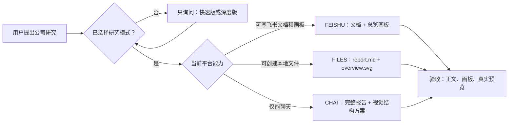
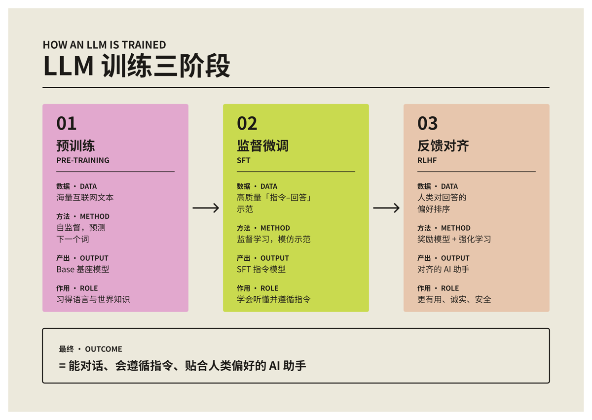
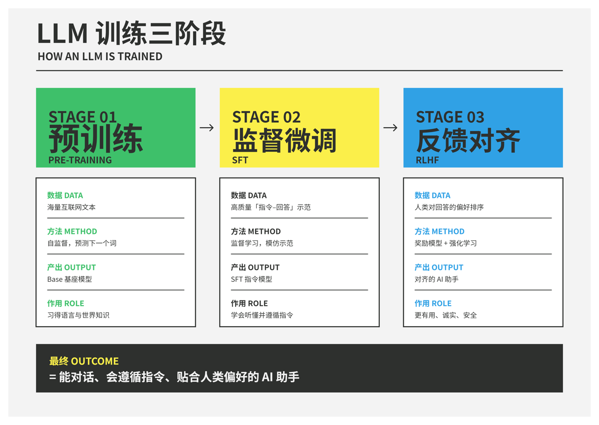

# 企业与行业研究 Skill

把“研究一下这家公司”转成一个可复用、可验收的研究交付流程：先确认研究深度，再根据当前平台能力选择飞书文档、本地文件或对话交付；无论快速版或深度版，均要求输出可阅读的报告、对话中的关键结论，以及一张概括全篇的总览画板。

> 当前版本：**V4.2**  
> 适用对象：需要研究公司、品牌、业务平台、行业格局或产业链的人。

## 它解决什么问题

普通研究提示词往往会产出一篇内容齐全但不易判断、也不易复用的长文。本 Skill 将研究拆成四个不可混淆的环节：先选择深度，确认交付能力，再形成有证据边界的判断，最后验证交付物是否真实存在。



### 两种研究模式，三项交付物

| 维度 | 快速版 | 深度版 |
| --- | --- | --- |
| 适用场景 | 快速理解、故事选题、下一步访谈 | 正式汇报、战略判断、公开材料 |
| 研究重点 | 中心判断、关键事实、竞争替代、风险 | 基本面、行业、产业链、竞争、PEST、SWOT 与战略展望 |
| 正文篇幅 | 只展开会改变判断的内容 | 完整展开，并说明事实、推断与未知 |
| 对话摘要 | 必须 | 必须 |
| 完整报告 | 必须 | 必须 |
| 总览画板 | **必须** | **必须** |

快速版只压缩研究范围和正文篇幅，**不减少交付物**。文字章节只是报告结构，不是可以省略画板的授权。

## 使用方式

安装后，直接提出研究请求即可：

```text
研究一下阿里云
```

若你没有指定研究深度，Skill 只会先问一句：

```text
你希望使用快速版还是深度版？快速版适合快速理解和故事选题；
深度版适合正式汇报、战略判断或公开材料。
```

也可以一次说清：

```text
用深度版研究蓝色光标，默认创建飞书文档。
```

如果你明确说“无需询问，直接研究”，Skill 会以快速版执行，并在完成凭证中写明这个默认假设。

## 交付原则

### 1. 先判断研究对象，而不是套模板

Skill 会先区分对象是独立披露主体、集团业务单元，还是品牌/业务平台。业务单元没有单独披露时，不会把集团财报冒充成该业务的数据。

### 2. 用中心判断组织研究

报告必须给出可被证据推翻的中心判断，并区分：

- **事实**：可追溯到公司、监管、权威媒体或研究机构的资料；
- **推断**：由多个事实导出的解释，必须说明推理边界；
- **未知**：公开资料无法验证的部分，不用臆测填补。

### 3. 画板是摘要，不是目录

总览画板通常由 4–6 个视觉模块构成，覆盖业务引擎、经营质量或商业化信号、行业位置与外部压力、增长命题与证据边界。它使用 3–6 个关键事实锚点，不以“章节卡片堆叠”代替分析。

<p align="center">
  
  
</p>

画板视觉系统随包提供，不依赖额外安装 `beautiful-feishu-whiteboard`。其中包含：

- 35 套可选择的配色与版式模板；
- 针对飞书可编辑 SVG 画板的形状、文字、连接线和渲染限制；
- 画板写入后导出预览、人工查看、修正溢出/遮挡的验收规则。

## 飞书与其他平台的兼容边界

Skill 默认优先创建飞书文档，但**不会假定所有平台都能写入飞书画板**。运行时应先验证实际能力，并按下表交付：

| 通道 | 前提 | 交付内容 | 验收要求 |
| --- | --- | --- | --- |
| `FEISHU` | 可写飞书文档、可写入非空画板、可导出预览 | 飞书文档 + 文档内总览画板 | 必须查看飞书实际预览 |
| `FILES` | 无飞书能力，但可创建本地文件 | `report.md` + `overview.svg` | 两个文件真实存在、可打开 |
| `CHAT` | 不能创建飞书或本地文件 | 完整报告 + 画板结构方案 | 明确说明能力限制 |

若飞书文档能创建但画板写入失败，必须如实标为降级：保留文档链接、提供 SVG/PNG，并明确写出“飞书画板未写入”。不得因为使用快速版、篇幅有限或正文大纲未列出画板而静默跳过。

## 完成凭证

每次研究的最终回复都包含以下字段，便于判断交付是否真的完成：

```text
执行版本：company-industry-research-v4 / 4.2
研究模式：快速版或深度版
交付通道：FEISHU / FILES / CHAT
报告状态：已创建 / 已降级 / 失败
画板状态：已写入飞书并预览 / 已生成 SVG 但未写入飞书 / 仅提供结构 / 失败
```

## 安装

### Codex

将本目录放入本机的 Skills 目录（通常为 `~/.codex/skills/`），重启或刷新 Skills 后使用。目录名保持为 `company-industry-research-v4`。

### 豆包工作或其他支持自定义 Skill 的平台

上传本仓库的 ZIP 压缩包，或按目标平台的规范上传完整目录。平台是否真正具备飞书文档与画板写入权限，需要在首次运行时验证；Skill 会根据真实能力降级，不应虚构链接或画板预览。

## 项目结构

```text
company-industry-research-v4/
├── SKILL.md                         # 流程入口与四个验收 Gate
├── references/
│   ├── research-fast.md              # 快速版研究范围
│   ├── research-deep.md              # 深度版研究范围
│   ├── evidence-rules.md             # 证据与表述边界
│   ├── platform-routing.md           # FEISHU / FILES / CHAT 路由
│   └── deliverable-contract.md       # 报告、画板与完成标准
├── visual-system/                    # 自包含的飞书 SVG 画板规范与模板
│   ├── RULES.md
│   ├── CATALOG.md
│   ├── svg-spec.md
│   ├── templates/                    # 35 套模板说明
│   └── assets/styles/                # 对应风格预览
└── scripts/validate-package.sh       # 包结构校验
```

## 本地校验与打包

在 Skill 目录内执行：

```bash
bash scripts/validate-package.sh
zip -qr ../company-industry-research-v4.2.zip .
unzip -t ../company-industry-research-v4.2.zip
```

校验会确认必要文件、35 套模板与 35 张风格预览均存在；它不替代对实际飞书文档和画板预览的验收。

## 许可

本仓库中的画板视觉系统沿用 [MIT License](visual-system/LICENSE)，其中保留原始版权声明。使用、修改与再分发时请一并保留该许可文本。
